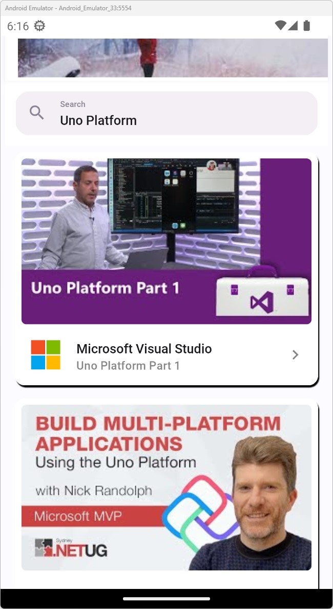

# Module 5 - Creating the UI

This module is an alternative way of creating the UI from C# Markup without importing it from Figma.

It includes the C# Markup building blocks that are used in our app if you decide to skip [module 4](xref:Workshop.TubePlayer.Figma) and import it from Figma.

## Import `MainPage`

Replace the contents of *MainPage.cs* with the following:

    
<i>MainPage.cs</i> code contents (collapsed for brevity)

[!code-csharp[MainPage.cs](MainPage.cs)]

## Import `VideoDetailsPage`

Replace the contents of *VideoDetailsPage.cs* with the following:

    
<i>VideoDetailsPage.cs</i> code contents (collapsed for brevity)

[!code-csharp[VideoDetailsPage.cs](VideoDetailsPage.cs)]

## Run the app

Run the app (<kbd>F5</kbd> on Visual Studio) and observe the UI changes, it should look similar to the following:

If you try tapping one of the videos in the list, an exception will occur. This is because navigation has not yet been implemented. You will address that in [Module 7 - Navigation](xref:Workshop.TubePlayer.Navigation).  
The image above the search page is a random image. It will be replaced in [Module 11 - App finalization](xref:Workshop.TubePlayer.Finalization)

## Next Step

In the next step, you will adjust the UI you've imported by overriding the app's color theme.

**[Previous](xref:Workshop.TubePlayer.MockData "Connect UI with mock data")** | **[Next](xref:Workshop.TubePlayer.ThemeOverrides "Theme overrides")**