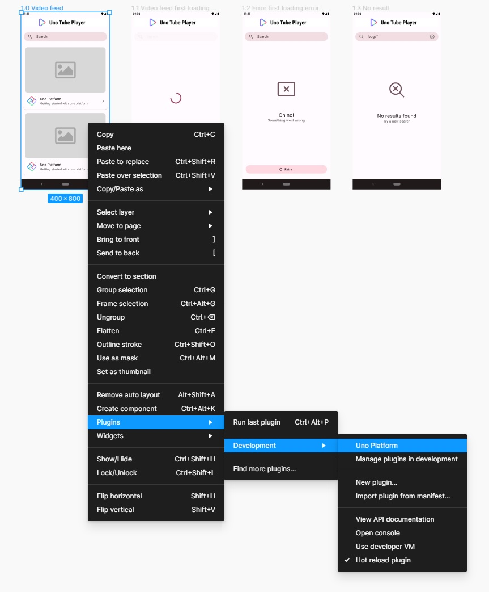
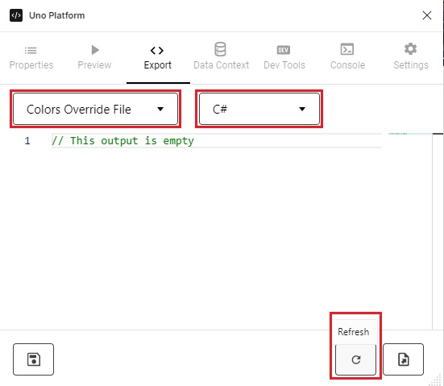
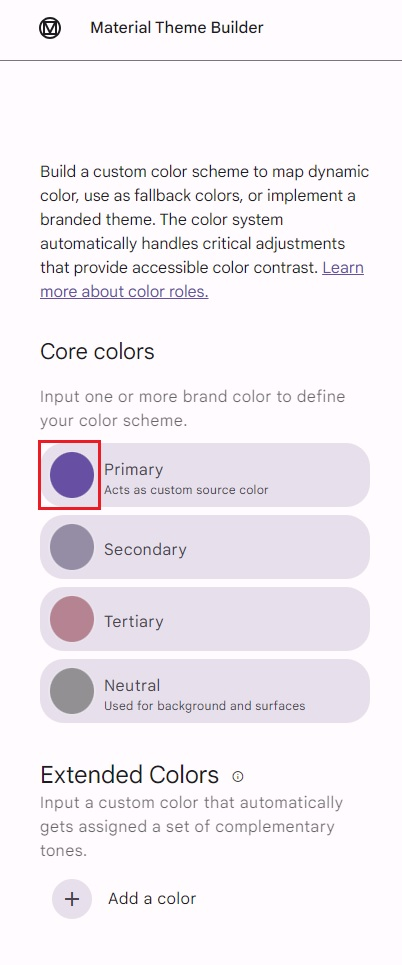
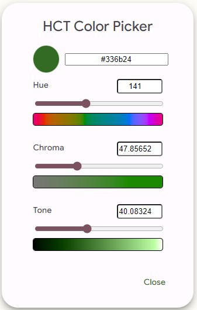
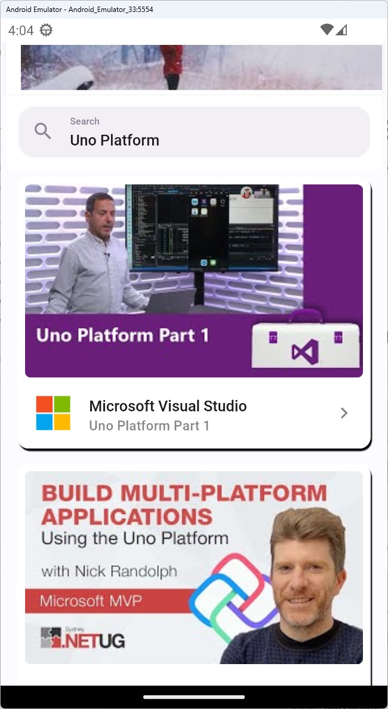
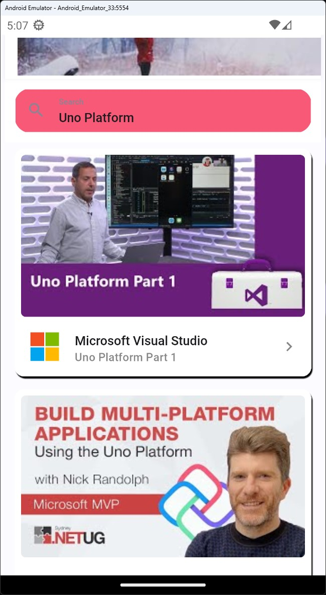

# Module 6 - Theme override

In this module, you'll learn how to import a override the Tube Player app's visual appearance.

Uno Platform offers two ways to import app themes.

1. Import color overrides in C# Markup form - will be imported from the Uno Platform plugin for Figma in this workshop. It will also be provided as is in the [export from Figma section](#export-from-figma) - if you do not wish to use Figma).
2. Create and import a custom DSP theme.

## Prepare the theme override

# [Figma](#tab/export/figma)

## Export from Figma

1. Go back to the Figma window.  
    If the Uno Platform plugin has closed, press <kbd>Ctrl</kbd>+<kbd>Alt</kbd>+<kbd>P</kbd> to reopen it, or right-click the *Video detail* screen and select the plugin from the *Plugins* submenu.

    
    -
    

1. Make sure you have the *Export* tab open, and from the drop down select *Colors Override File*. Select *C#* from the other dropdown if it's not already selected, then click *Refresh*.

    

1. A `ResourceDictionary` represented in C# Markup will be generated, holding all information about this theme.

    <details>
        <summary><i>ColorPaletteOverride.cs</i> code contents (collapsed for brevity)</summary>

    [!code-csharp[ColorPaletteOverride.cs](ColorPaletteOverride.cs)]
    </details>

1. Select and copy all code in the Figma code editor to the clipboard.

## Import C#

1. Head over to the IDE and delete the *ColorPaletteOverride.zip* file. This won't be needed as you're importing the color overrides from Figma. It's used when importing a DSP theme from an external editor (switch to the <!--TODO make sure link works -->[DSP tab](#tab/export/dsp) for more).

1. Open the file *ColorPaletteOverride.cs* located in the *Styles* folder, and replace the code in its constructor with what you have in your clipboard.

> [!TIP]
> You can also override the Figma theme from a custom DSP file. Read [this](xref:Uno.Figma.Learn.Designers.Dsp) to learn more about it.

1. The theme from Figma looks similar to what the app already looks like as you've used the Material template, let's then make a noticeable color override, so that you can see how the app changes accordingly.  
    Change the line that overrides `Theme.Colors.Surface.Variant` to the following colors:

    ```csharp
    -.Add<Color>(Theme.Colors.Surface.Variant, light: "#F2EFF5", dark: "#47464F")
    +.Add<Color>(Theme.Colors.Surface.Variant, light: "#F85977", dark: "#67E5AD")
    ```

# [DSP](#tab/export/dsp)

## Create a custom theme and import DSP

DSP stands for [Design System Package](https://github.com/AdobeXD/design-system-package-dsp) and is a conventional way to transport design themes between different systems.
There are several theme builders out there, the [Material Theme Builder](https://m3.material.io/theme-builder#/custom) is one of them, once a theme is created, it can be exported as a DSP file (it's a compressed *.zip* archive that includes all the data needed).

1. Copy the full path of the *ColorPaletteOverride.zip* located in the *Styles* folder and keep it in the clipboard.  
    In Visual Studio you can right-click on the file and select *Copy Full Path*.

1. Rename the zip file to *ColorPaletteOverride.zip.bak*, this will be a backup of the original file.

1. Head over to the [Material Theme Builder](https://m3.material.io/theme-builder#/custom) website, where you will create custom coloring for the Material theme.

1. On the left navigation bar, click the color in the *Primary* color choice button.

    

1. A HCT (Hue Chroma Tone) color picker opens up. Select a color that is visually different than the existing one, so you can see its effect on the app, then hit *Close*.

    

1. On the top-right corner open the *Export* menu and select *Material Tokens (DSP)*.

1. When prompted to save the file, paste the copied path into the file name text box, then click *Save*. Otherwise rename the downloaded file to *ColorPaletteOverride.zip* and move it to the *Styles* folder.

1. When building the app, Uno Platform reads the *ColorPaletteOverride.zip* file, and applies its color overrides into the *ColorPaletteOverride.cs* file.

---

## Run the app

Since the colors generated with the project are already set to Material theme, there will be no noticeable differences in the generated app. However if you change one of the colors you might spot the differences:

Regular:



With color overrides:


Note that the colors will be different than you see in the screenshot if you've created your own DSP theme.

If you try clicking the various search results, the app will crash. This is because we haven't implemented the navigation yet. You are going to address that in the following module.

### Restore colors

If you chose the DSP path above, you would now want to restore the app to its original colors.

You can achieve this in the following two ways:

1. Remove the imported *ColorPaletteOverride.zip* file and remove the *bak* extension from *ColorPaletteOverride.zip.back*
1. Delete the *ColorPaletteOverride.zip* file, and replace *ColorPaletteOverride.cs* with the following:

<details>
    <summary><i>ColorPaletteOverride.cs</i> code contents (collapsed for brevity)</summary>

[!code-csharp[ColorPaletteOverride.cs](ColorPaletteOverride.cs)]
</details>

## Next steps

Keep Figma open, as we will be importing additional templates from it in [Module 10 - FeedView templates](xref:Workshop.TubePlayer.FeedView)

**[Previous](xref:Workshop.TubePlayer.UI "Creating the UI")** | **[Next](xref:Workshop.TubePlayer.Navigation "Navigation")**