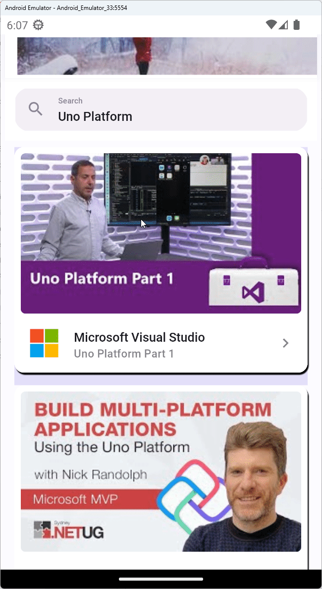

# Module 7 - Navigation

In this module, you'll learn how to utilize the [Uno Platform Navigation extension](xref:Overview.Navigation) to navigate and pass data between pages.  

Let's review the flow of the two pages in our app: `MainPage` displays the search box and its results. When the user clicks a search result, a navigation to the video player page (`VideoDetailsPage`) is initiated and the underlying `YoutubeVideo` object of the `ListView` item that was clicked is passed on to the video player page.  
The user can then navigate back to the previous search results page.

## Register navigation routes

Open the *App.cs* file, look for the `RegisterRoutes` method, and adjust the `DataViewMap` so that it uses `YoutubeVideo` instead of `Entity`. This is the data that will be passed on from `MainPage`.

    ```csharp
    new DataViewMap<VideoDetailsPage, VideoDetailsModel, YoutubeVideo>()
    ```

## Set up `MainPage` to navigate when a search result is clicked

Apply the following C# Markup extension methods to the `ListView`:

```csharp
.IsItemClickEnabled(true)
```
    
The `Navigation` extension of the `ListView` configures it to navigate when an item is clicked to the `VideoDetails` page. It will also pass on the current data item which is an instance of `YoutubeVideo` and be provided to the subsequent `VideoDetailsModel` created for it, according to how you configured it in the routing.  

## Remove the *Entity.cs* file [optional]

You may delete the *Entity.cs* file (located under *Business* → *Models*), as there's no longer any use of it.

## Run the app

Run the app and observe the changes. When clicking one of the YouTube search results, the *VideoDetailsPage* will be navigated to and the *YoutubeVideo* will be passed on to it.



## Next module

So far you have only worked with mock data. In the upcoming module, you will switch the app to return search results from YouTube.

**[Previous](xref:Workshop.TubePlayer.ThemeOverrides "Theme overrides")** | **[Next](xref:Workshop.TubePlayer.ApiEndpoints "Add API endpoints")**