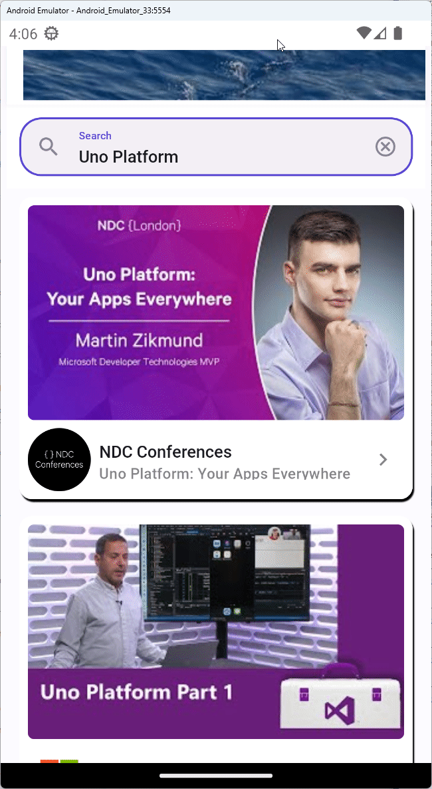
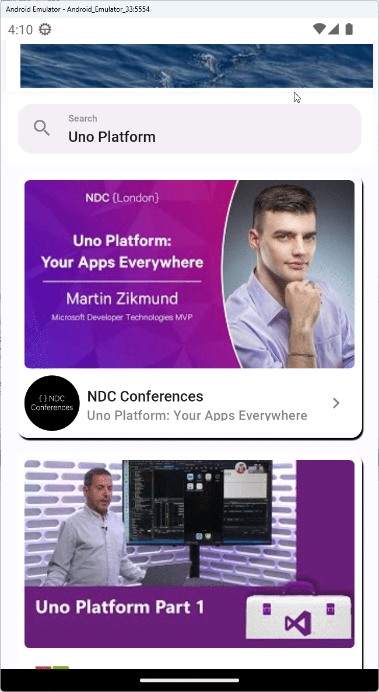
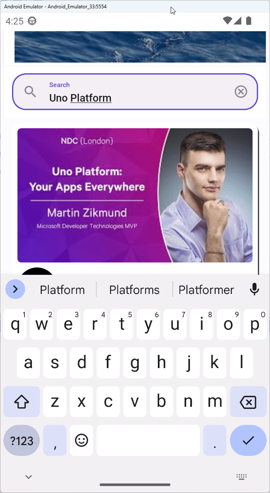

# Module 9 - `FeedView` none and error templates

In the previous module, you've observed how the view doesn't have a special reaction to a service-response that contains no results. In addition, you've also seen how the UI fails to indicate a connection error.  
In this module, you'll learn about the power of the `FeedView` control, and how to use and customize its none (no data) and error templates.

## Extract the item template into a separate method

1. Open the *MainPage.cs* file and select and cut the entire lambda call contained in the `ItemTemplate` extension method of the `ListView` starting from `youtubeVideo => ...` (<kbd>Ctrl</kbd>+<kbd>X</kbd> on Windows).
    One way to identify the closing parenthesis is by placing the cursor on the opening parenthesis and then checking the keyboard cursor column position (on the bottom-right of the text editor), or by using the arrow to go in a straight line to identify the closing one.

1. In the `MainPage` class, create a static method that returns a `UIElement` named `VideoItemTemplate` and paste the clipboard contents instead of its parameters parentheses, in the following signature:

    ```csharp
    private static UIElement VideoItemTemplate(YoutubeVideo youtubeVideo)
    ```

1. Paste the cut lambda and remove the old `youtubeVideo` parameter which is now duplicated.

1. Add a closing semicolon (`;`) to terminate this method.

1. Here's the final result:

    <details>
        <summary><code>VideoItemTemplate</code> method (collapsed for brevity).</summary>
    
    [!code-csharp[VideoItemTemplate.cs](VideoItemTemplate.cs)]
    </details>

1. Replace the `ListView`'s `ItemTemplate` extension method with the following:

    ```csharp
    .ItemTemplate<YoutubeVideo>(VideoItemTemplate)
    ```

## Add a `FeedView` to the UI and customize the `NoneTemplate`

### Add FeedView

The `FeedView` control is shipped as part of the MVUX and is tailored to work with feeds and states.  
It reacts visually to the current state of the data and its underlying request. Here's a brief overview of the templates it currently supports:

- `ValueTemplate` - used when there are ordinary data results
- `NoneTemplate` - used when there was no data found
- `ErrorTemplate` - used when an error occurs while requesting data
- `ProgressTemplate` - used when the underlying feed or state is busy loading data
- `UndefinedTemplate` - used when the control initializes, before the request is sent

> [!TIP]  
> To learn more about the `FeedView`, head over to [its docs page](xref:Overview.Mvux.FeedView).

Let's add a `FeedView` to our UI. We'll start with the `ValueTemplate` first.

1. Open the file *MainPage.cs* and wrap the search results `ListView` in a `FeedView`:

    ```csharp
    new FeedView()
        .AutoLayout(primaryAlignment: AutoLayoutPrimaryAlignment.Stretch)
        .VerticalAlignment(VerticalAlignment.Stretch)
        .VerticalContentAlignment(VerticalAlignment.Stretch)
        .Source(() => vm.VideoSearchResults)
        .ValueTemplate<FeedViewState>(feedViewState =>
            new ListView()
                ...
        )
    ```

    Feed free to touch up the code and indent it by selecting the code and pressing <kbd>Tab</kbd> or <kbd>Shift</kbd>+<kbd>Tab</kbd> to indent/unindent code in Visual Studio.

1. Change the `ItemsSource` property of the `ListView` to the `Data` property of the `FeedViewState` as follows:

    ```csharp
     ...
     new ListView()
    -    .ItemsSource(b => b.Bind("VideoSearchResults"))
    +    .ItemsSource(() => feedViewState.Data)
         ...
         .ItemTemplate(VideoItemTemplate)
     ...
    ```

    The `FeedView` serves the data via the `FeedViewState` wrapper class to the template, the actual data is accessed via the wrapper's `Data` property.
 
### Run the app [optional]

The `FeedView`'s error template defaults to *An error occurred' text message. If you run the app, switch flight-mode on, and search YouTube, that message will display:

    

### Customize the `NoneTemplate`

Add the following `Shapes` namespace, as well as the `Path` alias to the header of *MainPage.cs*, so that there are no ambiguations with `System.IO.Path`, as there are `Path` elements contained in the templates you are about to introduce to the project.

    ```csharp
    using Microsoft.UI.Xaml.Shapes;
    using Path = Microsoft.UI.Xaml.Shapes.Path;
    ```

# [Import from Figma](#tab/none-template/figma)

1. Open Figma and select the *1.3 No search results state* screen.

1. Open the Uno Platform plugin (<kbd>Ctrl</kbd>+<kbd>Alt</kbd>+<kbd>P</kbd>), and navigate to the *Export* tab.

1. Click the *Refresh* button.

    

1. In the generated C# code, skip the navigation bar and the search box parts, then select and copy the `AutoLayout` that follows, with all its descendants.

1. Add a private static method named `VideoErrorTemplate` returning `UIElement` into the `MainPage` class.

1. Paste the content copied from Figma as the return value of the method.

    ```csharp
    private static UIElement VideoNoneTemplate() =>
        /* copied content */
    ```

1. Append a semicolon (`;`) to the end of the method to terminate it.

# [Paste in code](#tab/none-template/direct)

Copy the following code to the clipboard:

<details>
    <summary><code>VideoNoneTemplate</code> method (collapsed for brevity).</summary>

[!code-csharp[VideoNoneTemplate.cs](VideoNoneTemplate.cs)]
</details>

---

Add the following setting to the `FeedView`:

```csharp
 new FeedView()
     ...
+    .NoneTemplate(VideoNoneTemplate)
     .ValueTemplate...
```

### Run the app

When you run the app next and delete the search term, you'll see how the `FeedView` switches to the `NoneTemplate` you've just set up when there is no data:



## Customize the `ErrorTemplate`

### Import template

# [Import from Figma](#tab/error-template/figma)

1. Open Figma and select the *1.2 Error first loading error* screen.

1. Open the Uno Platform plugin (<kbd>Ctrl</kbd>+<kbd>Alt</kbd>+<kbd>P</kbd>), and navigate to the *Export* tab.

1. Click the *Refresh* button.

    

1. From the generated C#, skip the navigation bar and the search box parts, then select and copy the `AutoLayout` that follows, with all its descendants.

1. Add a private static method named `VideoErrorTemplate` returning `UIElement` into the `MainPage` class:

1. Paste the content copied from Figma as the return value of the method.

    ```csharp
    private static UIElement VideoErrorTemplate() =>
        /* copied content */
    ```

1. Append a semicolon (`;`) to the end of the method to terminate it.

# [Paste in code](#tab/error-template/direct)

Copy the following code to the clipboard:

<details>
    <summary><code>VideoErrorTemplate</code> method (collapsed for brevity).</summary>

[!code-csharp[VideoErrorTemplate.cs](VideoErrorTemplate.cs)]
</details>

---

Append the following property setting to the `FeedView`:

```csharp
new FeedView()
    ...
    .ErrorTemplate(VideoErrorTemplate)
    ...
```

<!-- TODO implement refresh button -->

### Run the app

1. Run the app. Search results for the term *Uno Platform* will be loaded from YouTube.
1. Disable the device's network (flight mode).
1. Perform a new search by changing the search term.
1. Observe how the error template is displayed.
1. Restore the internet connection and return to the result.
1. Click one of the search results, and you'll notice that the video on the video page doesn't play. In the upcoming module, you'll add a media player control to the app, which will play the videos.
    
    

## Next Step

**[Previous](xref:Workshop.TubePlayer.ApiEndpoints "Add API endpoints")** | **[Next](xref:Workshop.TubePlayer.MediaPlayer "Add a media player")**